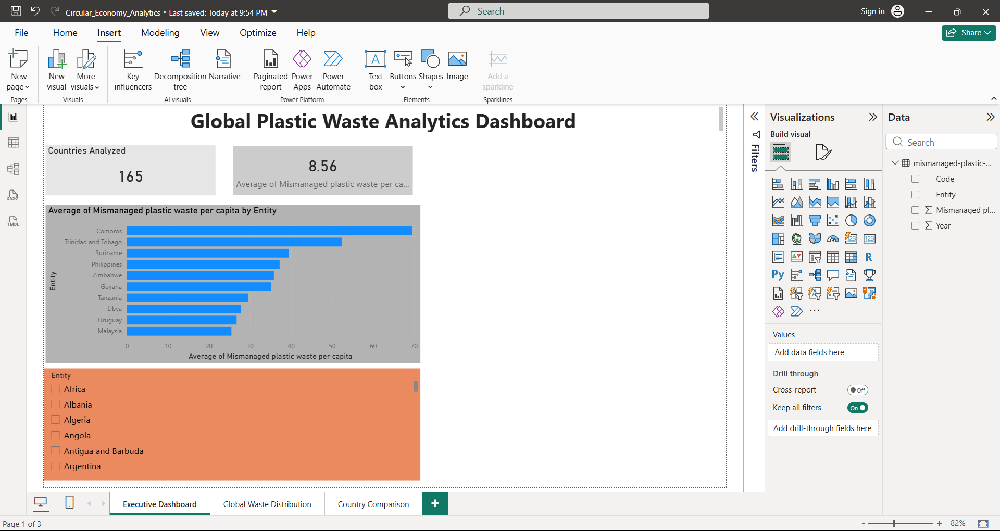
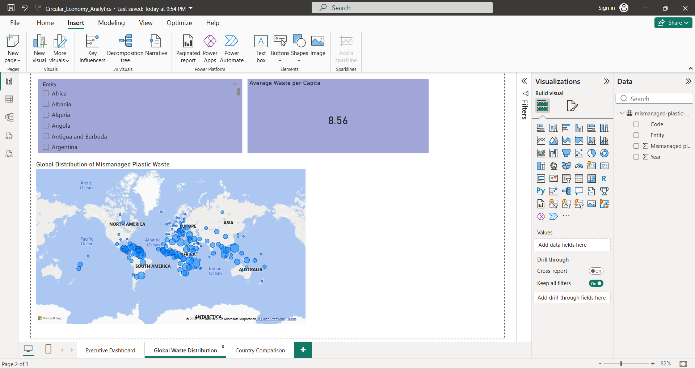
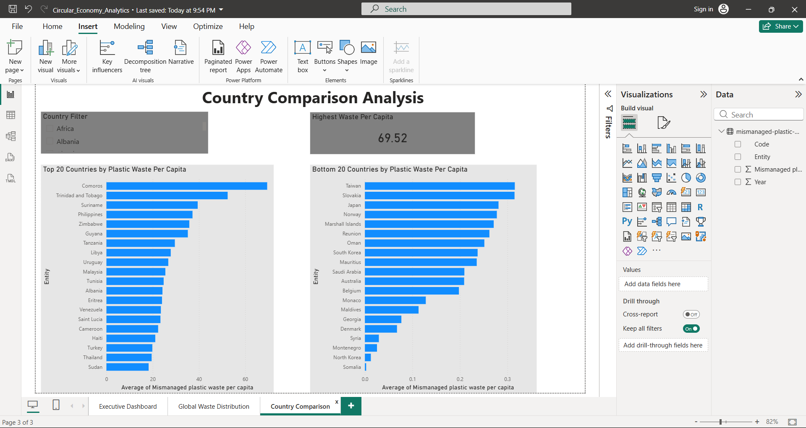

# Circular Economy Analytics: Global Plastic Waste Analysis

## Project Overview

This project analyzes global mismanaged plastic waste per capita using Python and Power BI. The objective is to explore plastic waste distribution across countries, identify countries with the highest and lowest waste per capita, and present insights through interactive dashboards.

## Dataset

Source: Mismanaged Plastic Waste Per Capita Dataset

The dataset contains information on:

- Country/Entity
- Year
- Mismanaged Plastic Waste Per Capita

## Tools and Technologies

- Python
- Pandas
- Matplotlib
- Power BI
- CSV Data Files

## Project Structure

```
Circular-Economy-Analytics/
│
├── data/
│   ├── raw/
│   │   └── mismanaged-plastic-waste-per-capita.csv
│   └── cleaned_mismanaged_plastic_waste.csv
│
├── python/
│   ├── clean_data.py
│   ├── analytics.py
│   └── visualization.py
│
├── powerbi/
│   └── Circular_Economy_Analytics.pbix
│
├── Screenshots/
│   ├── executive_dashboard.png
│   ├── global_distribution.png
│   └── country_comparison.png
│
└── README.md
```

## Data Processing

The dataset was cleaned and prepared using Python.

### Data Cleaning Steps

- Removed missing values
- Checked for duplicate records
- Standardized column names
- Prepared data for visualization and analysis

## Power BI Dashboards

### 1. Executive Dashboard

Features:

- Countries Analyzed
- Average Mismanaged Plastic Waste Per Capita
- Top Countries by Plastic Waste
- Interactive Country Filter

### Dashboard Preview



---

### 2. Global Distribution Dashboard

Features:

- Interactive World Map
- Global Distribution of Plastic Waste
- Country-Level Exploration

### Dashboard Preview



---

### 3. Country Comparison Dashboard

Features:

- Top 20 Countries by Plastic Waste Per Capita
- Bottom 20 Countries by Plastic Waste Per Capita
- Interactive Country Filter
- Highest Waste Per Capita Indicator

### Dashboard Preview



---

## Key Insights

- Mismanaged plastic waste varies significantly across countries.
- Several island and developing nations show high waste per capita values.
- Interactive dashboards help identify geographical and country-level trends.

## How to Run the Project

### Python Scripts

Run the following scripts:

```bash
python clean_data.py
python analytics.py
python visualization.py
```

### Power BI Dashboard

1. Open Power BI Desktop.
2. Open `Circular_Economy_Analytics.pbix`.
3. Refresh the data if required.
4. Explore the dashboards.

## Author

Prachi Biswajit Barua

## License

This project is created for educational and portfolio purposes.